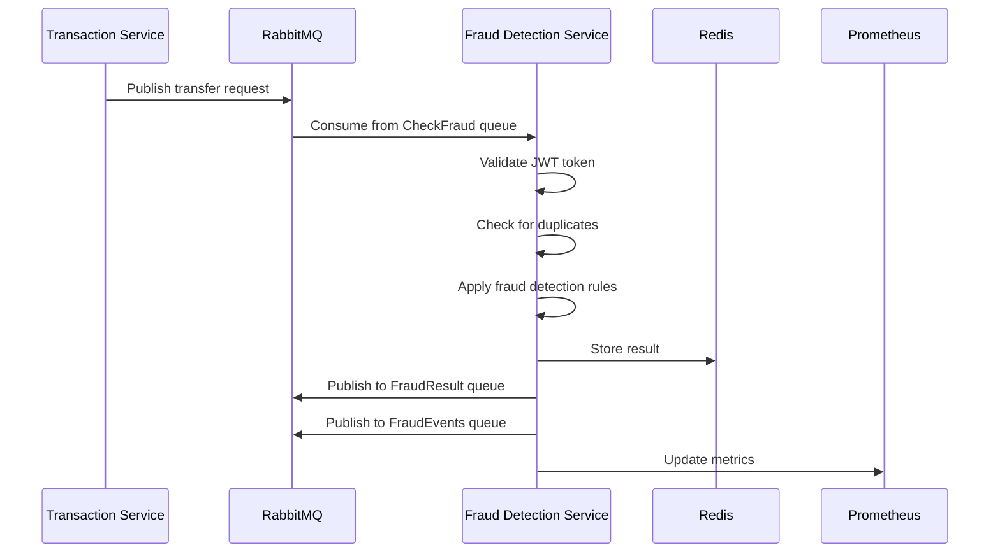

# Architecture Overview

## System Architecture

The Fraud Detection Service is designed as a microservice within the DLS Banking App ecosystem, focusing on real-time fraud detection for banking transactions. The service follows event-driven architecture principles and is built for scalability and reliability.

## Core Components

### 1. Message Consumer
- Listens to `CheckFraud` queue on RabbitMQ
- Deserializes and validates incoming messages
- Manages consumer scaling and message distribution
- Implements retry and dead-letter queue mechanisms

### 2. Fraud Detection Engine
- Implements fraud detection rules and algorithms
- Processes transaction data in real-time
- Configurable rules engine for fraud detection
- Supports multiple fraud detection strategies

### 3. Result Publisher
- Stores results in Redis for quick retrieval
- Publishes events to monitoring queues
- Implements idempotency checks
- Handles failure scenarios gracefully

### 4. Health Monitor
- Monitors system health and dependencies
- Exposes health check endpoints
- Manages graceful shutdown
- Reports system metrics

## Data Flow

## Key Design Decisions

### 1. Asynchronous Processing
- Why: Enables high throughput and scalability
- How: RabbitMQ message queues
- Benefits: Decoupled services, better fault tolerance

### 2. Redis for Result Storage
- Why: Fast access to fraud check results
- How: Key-value storage with TTL
- Benefits: Low latency, automatic cleanup

### 3. Event-Driven Architecture
- Why: Real-time processing and monitoring
- How: Message queues and event publishing
- Benefits: Loose coupling, easy scaling

### 4. Stateless Design
- Why: Horizontal scalability
- How: No local state, shared Redis
- Benefits: Easy deployment, high availability

## Security Measures

### 1. Authentication
- JWT token validation
- Service-to-service authentication
- Token scope verification

### 2. Data Protection
- In-transit encryption (TLS)
- Secure configuration management
- Sensitive data handling

### 3. Rate Limiting
- Per-consumer limits
- Global service limits
- Configurable thresholds

## Scalability

### 1. Horizontal Scaling
- Multiple service instances
- Queue consumer groups
- Load balancing

### 2. Performance Optimization
- Connection pooling
- Batch processing capability
- Resource utilization monitoring

### 3. Resource Management
- Memory usage optimization
- Connection management
- Thread pool configuration

## Fault Tolerance

### 1. Circuit Breakers
- Redis connection
- RabbitMQ connection
- External service calls

### 2. Retry Mechanisms
- Message processing retries
- Dead letter queues
- Error handling policies

### 3. Fallback Strategies
- Default responses
- Graceful degradation
- Error reporting

## Dependencies

### External Services
- RabbitMQ (message broker)
- Redis (result storage)
- Prometheus (metrics)
- Elasticsearch (logging)

### Libraries
- FastAPI (web framework)
- Pika (RabbitMQ client)
- Redis-py (Redis client)
- PyJWT (JWT handling)

## Configuration Management

### 1. Environment Variables
- Service configuration
- Credentials
- Feature flags

### 2. Dynamic Configuration
- Runtime updates
- Feature toggles
- Threshold adjustments

## Deployment

### 1. Container Configuration
- Docker image
- Resource limits
- Health checks

### 2. Kubernetes Setup
- Deployment configuration
- Service definition
- Resource quotas

### 3. Monitoring Setup
- Prometheus integration
- Grafana dashboards
- Alert configuration

## Future Improvements

### 1. Technical Enhancements
- Machine learning integration
- Real-time rule updates
- Performance optimizations

### 2. Operational Improvements
- Enhanced monitoring
- Automated scaling
- Improved error handling

### 3. Feature Additions
- Additional fraud detection rules
- API extensions
- Integration capabilities 